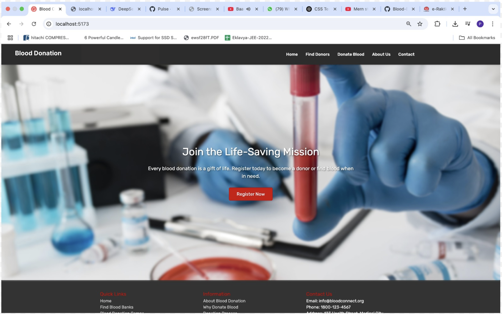

# Blood Donation Social Media Website

## Overview

The Blood Donation Social Media Website is a dynamic and user-friendly platform developed to revolutionize the traditional blood donation process. Leveraging cutting-edge technologies such as React.js, Node.js, Express.js, MongoDB, CSS, and Tailwind CSS, our platform aims to bridge the gap between blood donors and recipients, ensuring prompt and efficient coordination.

## Technologies Used

### 1. React.js

React.js is a powerful JavaScript library that facilitates the creation of interactive user interfaces. The Blood Donation Social Media Website employs React.js to build a modular, reusable, and engaging front-end, enhancing the overall user experience. The virtual DOM and component-based architecture contribute to the platform's efficiency and responsiveness.

### 2. Node and Express.js

Node.js, in conjunction with the Express.js framework, forms the backbone of our server-side architecture. The non-blocking, event-driven nature of Node.js ensures swift and scalable server operations. Express.js simplifies web application development, enabling seamless communication between the front-end and back-end. This combination enhances the platform's responsiveness and supports real-time updates.

### 3. MongoDB

MongoDB serves as the database for our project, providing a scalable and flexible NoSQL solution. The JSON-like data format accommodates the diverse information associated with blood donation, from donor profiles to coordination details. MongoDB's scalability ensures efficient data management for our growing user base.

### 4. CSS and Tailwind CSS

CSS and Tailwind CSS are instrumental in shaping the visual appeal and responsiveness of our website. Custom styling with CSS ensures a unique design, while Tailwind CSS streamlines styling through utility-first classes. This combination results in a visually appealing and consistent design, contributing to a positive user experience.

## 📸 Screenshot

